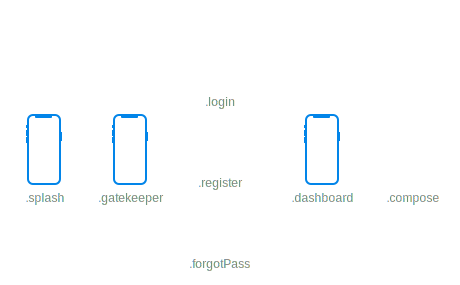

<p align="center">
  
</p>

<div align="center">

[](https://developer.apple.com/xcode/swiftui)
[](https://swift.org)
[](https://developer.apple.com/xcode)
[](https://opensource.org/licenses/MIT)

</div>

Helm is a declarative, graph-based navigation library for SwiftUI. It's like a router on steroids that fully describes all the navigation flows in an app and can handle complex overlapping UI, modals, deeplinking and much more.

## Index
* [Features](#features)
* [Overview](#overview)
* [Error handling](#error-handling)
* [Deeplinking](#deeplinking)
* [Snapshot testing](#snapshot-testing)
* [Examples](#example)
* [License](#license)

## Features

✅ declarative

✅ lightweight, expressive and easy to use

✅ deeplinking and snapshot testing ready

✅ built for all Apple platforms

✅ zero 3rd party dependencies
 
✅ fully tested


## Overview

Helm has a declarative approach, which means you have to first construct the underlying navigation graph with its nodes, edges and rules, and only then, you can harness its power in SwiftUI.

### Define the navigation graph

First we have define all the possible dynamic sections of the app: some might be full screens, others, just overlapping views, like a player in a music listening app. This is usually done in an `enum` conforming to the `Node` protocol. This step is done as soon as the app starts and the resulting graph is not mutable (although you can mutate the traits as we will see later).

```swift
enum Section: Node {
    // the first screen right after the app starts
    case splash

    // the screen that contains the login, register or forgot password sections
    case gatekeeper
    // the three sections of the gatekeeper screen
    case login
    case register
    case forgotPass
    
    // once the user is logged in, the dashboard is available
    case dashboard
    // which has 2 sections
    case news
    case library
    
    // also, let's say that you can write new articles once you can access the dashboard
    case compose
    
    // and so on ...
}
```

Conceptually, we now have:

<p align="center">
  
</p>

Just a bunch of sections in our app, but with no navigation rules. In Helm, navigation rules are defined using segues and segues traits. Segues define the edges that connect the app sections and their direction, while traits add extra constraints for using relative navigation (it helps Helm understand what do we mean by `dismiss()` or `forward()`) and for disabling, redirecting or presenting overlapping nodes (more about this a bit later).

We have to first define the segues. For that, we will use a `Flow` which is just an ordered collection of unique segues. Normally, we'd need to create and add each segue manually:

```swift
// don't do this, use segue operators
let flow = Flow<Section>(segue: Segue(.splash, to: .gatekeeper))
    .add(segue: Segue(.splash, to: .dashboard))
    .add(segue: Segue(.gatekeeper, to: .login))
    .add(segue: Segue(.gatekeeper, to: .register))
    // and so on ...
```

This is extra verbose, so, instead, we can use the segue operators `=>` and `<=>`. `.splash => .gatekeeper` creates a directional segue between the two nodes, while `<=>` creates two segues (a bidirectional connection), `.login <=> .register <=> .forgotPass <=> .login`, which translates to: from each of the mentioned nodes you can visit the others.

The segue operators also support arrays, creating one to many segues (`.gatekeeper => [.login, .register, .forgotPass]`) or many to one segues (`[.login, .register] => .dashboard`). Segues operators don't support many-to-many connections.

Using the operators, the full flow definition becomes:

```swift
// depending on whether the user is logged in or not, 
// you can navigate from the .splash screen to the .gatekeeper or directly to the .dashboard
let flow = Flow<Section>(segue: .splash => [.gatekeeper, .dashboard])
    // the gatekeeper contains three sub-sections
    .add(segue: .gatekeeper => .login)
    // from each of the gatekeeper sub-section you can navigate to the others
    .add(segue: .login <=> .register <=> .forgotPass <=> .login)
    // both from .login and .register you can reach the dashboard
    // if the login or the register operation succeeds  
    .add(segue: [.login, .register] => .dashboard)
    // once in the dashboard, we can visit either the .news or the .library section
    .add(segue: .dashboard => [.news, .library]) 
    // also, you can go to the article section and back
    .add(segue: .dashboard <=> .compose)
```

We defined our navigation almost entirely. This corresponds to:

<p align="center">
  
</p>

Lastly, we create the navigation graph and add the segues traits.
First, since both `.gatekeeper` and `.dashboard` are container nodes and can't be presented by themselves, we shall automatically forward all navigation that passes through them to `.login` and `.news` respectively using the `.auto` segue trait.
Second, we need to let Helm know that `.compose` is a modal and that its siblings, `.library` and `.news` should not be deactivated when presenting it. We'll use the `.modal` segue trait to do so.
Third, since the user starts unauthenticated, we redirect all attempts to reach the `.dashboard` from the `.splash` to the `.gatekeeper` using the `.redirect(to:)` segue trait. This should change once the user becomes authenticated.

```swift
let graph = NavigationGraph(flow: flow)
// we add the `.auto` trait
graph.edit(segue: .gatekeeper => .login)
    .add(trait: .auto)
graph.edit(segue: .dashboard => .news)
    .add(trait: .auto)
// we mark .compose as a modal
graph.edit(segue: .dashboard => .compose)
    .add(trait: .modal)
// and redirect access to the .dashboard from .splash to the .gatekeeper
graph.edit(segue: .splash => .dashboard)
    .add(trait: .redirect(to: Flow(segue: .splash => .gatekeeper)))
```

Resulting our final navigation graph.

<p align="center">
  
</p>

### Navigating inside SwiftUI views

`NavigationGraph` is an `ObservableObject`, we need to inject it in your views hierachy using `environmentObject` at the top-most level so all of the views can access it.


```swift
struct RootView: View {
    var body: some View {
        ZStack {
            //
        }
        // in this example the graph we constructed is stored in a static field
        .environmentObject(NavigationGraph.main)
    }
}
```

Once we can access the navigation graph, we can navigate it using:

- `present(node:)`: presents a node; does nothing if the target node is not connected to the presented nodes
- `present(flow:)`: presents a flow or, in other words, a collection of nodes; does nothing if the first node in the sequence is not connected to the currently presented nodes
- `forward()`: attempts to navigate forward when there's exactly one egress segue from the last presented node; does nothing if there's no egress segue or if there are many  
- `back()`: attempts to revert the last visited segue using its counterpart; does nothing if there's no counterpart (i.e. `.login => .register`s counterpart is `.register => .login`) 
- `back(at:)`: similar to `back`, except it attempts to reach a certain node by going back as many segues as needed; does nothing if the node is not encoutered while navigating back to the bottom of the navigation stack
- `dismiss()`: deactivates the first node whose presenting segue has a `.context` or `.modal` trait
    
Finally, we use `isPresented(_ node:)` to hide or show a view when a node is presented or not. `isPresented` has 2 variants, one that returns a `Bool`, ideal for simple `if`s, and one that returns a binding, ready to work with many of Apple's presentation functions like `.sheet(isPresented:, content:)`.

```swift
struct DashboardView: View {
    @EnvironmentObject private var nav: NavigationGraph<Section>

    var body: some View {
        VStack {
            HStack {
                Spacer()
                Button(action: { nav.present(node: .compose) }) {
                    Image(systemName: "plus.square.on.square")
                }
            }
            if nav.isPresented(.library) {
                LibraryView()
                    .tabItem {
                        Label("Library", systemImage: "book.closed")
                    }
            }
            if nav.isPresented(.library) {
                NewsView()
                    .tabItem {
                        Label("News", systemImage: "newspaper")
                    }
            }
        }
        .sheet(isPresented: nav.isPresented(.compose)) {
            ComposeView()
        }
    }
}
```

## Error handling

There are no user-facing errors in Helm. All the possible errors originate from misconfigurations or unexpected usage (i.e. trying to follow a disabled segue). In Helm, such errors are logged in production and asserted in development. If for some reason you want to disable assertions in development as well (although, I'd strongly recommend against it, since it hinders testing), you can set `HELM_DISABLE_ASSERTIONS` environment variable to "1".

## Deeplinking

Deeplinking is really easy with Helm. All we have to do is translate our deeplink path to a flow and then navigate to that flow (i.e. `nav.present(flow: .dashboard => [.compose, .news])` would navigate to the dashboard, in the news tab, having the compose article modal open). Note that the serialized deeplink path can't be a linear structure (i.e. .dashboard => .news) and it's more like a partial graph where multiple nodes can originate from the same parent. This enables complex overlapping UI.  

## Snapshot testing

With Helm snapshot testing can be fully automated by walking the entire available navigation graph for each possible state of the app. In our example above, since the `.dashboard` is not available while the user is unauthenticated, the walker would only snapshot the `.gatekeeper` nodes. Once we update the state, the rest of the graph will be snapshot as well.
In the near future, I plan to implement the walker into Helm, making the process even easier. (PRs welcomed, of course)

## Examples

The package contains an extra project called `Playground`. It's integrating Helm with SwiftUI, including using `NavigationView`s, sheet modals, `TabView`, etc. Feel free to use it as a starting point.

## License
[MIT License](LICENSE)
